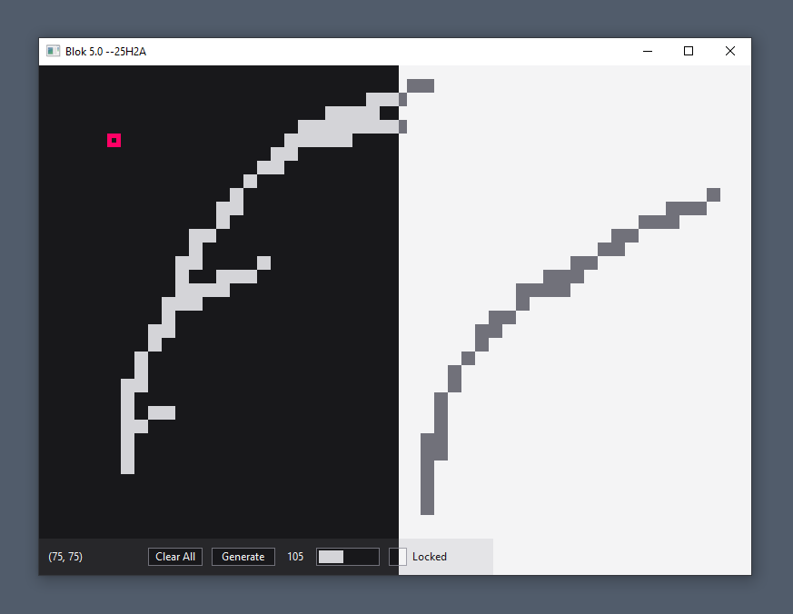

# Experimental Blok: An exploration of the Win32 API


> [!NOTE]
> This version "5.0 --25H2A" is currently still in development, the features described may
> not work correctly, at all, or subject to change. These changes will merged to main
> in Autumn 2025.

## Overview

"Experimental Blok", or simply "Blok" is a small and minimal simulation of a user
generated maze, and a box that moves around with the WASD or Arrow Keys.

This project originated as a way to learn C and the Windows API, although it was initially
written in C++, starting in February of 2021. _It was not available on GitHub at this_
_time_. This project had no specific goals or direction. The name "Blok" resulted from an
accidental misspelling of "block" during its initial phase, when I called it the "C
Project". The program could render a square that moved within a native window but would
leave a trail due to lacking window updates.

The motivation for creating this project is not entirely clear; however, I've always had
a strong interest in the Windows Operating System.



### The Canvas Grid

The "Canvas Grid" is a components that provides a coordinate grid, scaled at fifteen
pixels or another specified value at startup (via CLI). This grid contains the box entity
and a surface to create walls ("obstructs") that blocks the box's movement.

* The canvas is adapts to the full window client area.
* The grid lines can be toggled with `G` key, but is drawn before the box and obstructs -
resulting in parts of lines becoming hidden.
* A left click will create an obstruct at the current position.
* A left drag click will create a series of obstructs.
* A right click will remove an obstruct at the current position.
* A right drag click will remove a series of obstructs.

### The Information and Action Panel

The "Panel" is the component that shows information and provides controls to manipulate
the canvas.

* The current coordinates of box is shown.
* The "Clear All" button removes all obstructs.
* The "Generate" button adds an obstruct at a random position.
* Shows the current number of obstructs on the canvas.
* The progress bar shows the internal dynamic array memory size storing the obstructs.
* The locked toggle, shows whether the canvas has been locked
  * Enabled - any clicks or drags on the canvas are ignored.
  * Disabled - normal operation.

### The Console

The "Console" is a separate window displaying information, warning and/or error messages
while the program is running.

* Does not accept user input.
* Must be enabled on startup by passing the `--show-console` argument.

### Keyboard Shortcuts

* `W`: Move box up by current scale.
* `A`: Move box right by current scale.
* `S`: Move box down by current scale.
* `D`: Move box left by current scale.
* `G`: Toggle grid lines visibility.
* `O`: Generate an obstructive at a random location.
* `I`: Toggle interface visibility.
* `T`: Change theme.
* `C`: Clear all obstructives.
* `L`: Toggle canvas lock.

## The Architecture

The architecture of the program is based around the `Context` structure, storing the
state of the entire program as a sort of global through a singleton helper function.


| Folder | Description |
| :----- | :---------- |
| (main.c) | entrypoint. |
| base   | contains the main singleton context structure (stores all program data) and lifecycle functions |
| cmd | handles the console host allocation and argument processing. |
| gdi | handles the windows drawing and painting tools, and theme handling. |
| model | model object structures and operations. |
| store | stores the object state. |
| ui | handles the user interface (including event handling and components). |
| utils | any unclassified function such as converting from blok to win -types and vise versa. |

## Compilation and Execution

### Pre-requisites

* **CMake** (Minimum Version: 3.10): Required for building the project.
* **MSVC** (or a Compiler that Support C11).
* **Windows OS** (It can be compiled with MinGW on Linux, though designed for Windows).

Please note that Visual Studio, VSCode (with the CMake Extension), or CLion will
automatically build the project on Windows.

### Building the Project

```sh
# 1. Cloning the Repository and Move into Directory.
git clone https://github.com/harshjayprakash/experimental-blok.git
cd experimental-blok

# 2. Generate build files with CMake.
cmake -S . -B build

# 3. Compile the project
cmake --build build --config Release

# 4. Run the project
./build/Release/blok.exe
```

### Command Line Arguments

After compilation, the program can executed with various arguments to customise behaviour.
The available arguments are shown below.

| Argument          | Description                             |
| :---------------- | :-------------------------------------- |
| `--light-theme`   | Starts with the light theme.            |
| `--dark-theme`    | Starts with the dark theme. (default).  |
| `--show-console`  | Displays the console while running.     |
| `--scale [int]`   | Sets scale for both X and Y directions. |
| `--scale-x [int]` | Sets the scale for the X direction.     |
| `--scale-y [int]` | Sets the scale for the Y direction.     |

## Changelog

### Version 5.0 (Snapshot 25H2A) - September 2025

**Overview**: This version is complete rewrite.

#### Functionality

* **New Shortcuts**: Added new keyboard shortcuts for extra functionality.
* **Drag Click**: Implementated canvas drag-click for rapid obstruct creation and removal.
* **Obstruct Handling**: Re-added obstruct removal.
* **Instance Check**: Implemented a Mutex for a single running instance.
* **Custom Scaling Arguments**:
  * Implemented optional separate x and y scaling arguments.
  * Added absolute value check to handle negative inputs.
* **Non-Case Sensitive CLI Arguments**: Updated to use the `_wcsnicmp` function.

#### Visual

* **Panel Visibility**: Added `I` keyboard shortcut to toggle panel visibility.
* **Grid Lines**: Added `G` keyboard shortcut to toggle the grid lines visibility.
* **Font Upgrade**: Updated font to Segoe UI.
* **Redesigned UI**: Updated the UI for a more modern look.
* **Colour Scheme**: Increased colours in palette.
* **Updated Text Rendering**: Updated to use `DrawTextW` instead of `TextOutW` for richer options.
* **Hover Effects**: Add hover indication over controls.
* **Faster UI Updates**: Updated message loop to use `PeekMessage` instead of `GetMessage`.
* **Updated Panel Width**: Updated the panel to not span the whole width of the window.

#### Internal

* **Updated Architecture**: Focused on a more modular architecture based on the `Context` structure.
* **Build System Update**: Switch to CMake and Microsoft Cl Compiler.
* **Fully Unicode**: Switched to the `wWinMain` entrypoint.
* **Enhanced Documentation**: Updated technical documentation for clarity.
* **Static Data**: Removed all file-scope static variables.
* **Simplified Return Values**: Function return an integer instead of a result. (if not applicable, otherwise data is returned).
* **Refactor Types**: Renamed `Vector` to `DynList`, and `position` and `size` to `VectorII`.
* **Extracted Modules**: Modularised additional modules
  * **State Module**: An abstraction from direct data modification for the UI and stores the object data.
  * **Graphics**: A store for gdi graphics tools and colours decoupled from the UI.
  * **Arguments**: Updated to not rely on global application-specific funcions.
* **Top-Level UI Module**: Added a encapsulated Viewport UI module.
* **Update Naming Conventions**:
  * Variables prefixed with 'p' if pointer, 'h' if handle.
  * Function names follow 'blok' + '\<file-scope\>' + '\<function-name\>()'.
  * Function names are prefix with '_' if static.
  * Structures and enumerations are Pascal Case with '_' prefix.
  * Typedef follow Pascal Case.
* **List Node Removal**: Add Node Removal on DynList API.
* **Add Conversion Util Functions**:
  * Implemented WinTypes to BlokTypes and vice versa.
  * Implemented Direction to Vector function.
* **Extracted UI Logic**
  * **Process Event Methods**: Re-implemented event functions.
  * **Action UI Methods**: Re-implemented a set of abstracted functions for the UI to call state functions and updates.
* **Modular Controls and Components**:
  * Add separate update functions.
  * Updated to not rely on caller updating control/component attributes.
* **Simplify Model Grouping**: Flatten folder model structure.
* **Remove Unused**: Removed any unusued functions or structures.

## Limitations and Known Issues

* Generating an obstructs (Button/Keyboard) may create a duplicate positioned wall.
* Box can go under the panel.
* Box can go out of bounds of the window.
* Specified scaling can be too small or too big.
* Drag click can continue if the cursor leaves the window.
* Holding down the generate button will not continue to generate obstructs.

## Potential Future Features

* Move around canvas.
* Movable panel.
* Re-sizable panel.
* Custom theming.
* Loading configuration from file.
* File-based logging.
* Small alert box system.
* Keyboard shortcut guide screen.
* Save state to file.
* Import state from file.
* Generate entire maze.
* Find path from box to point.
