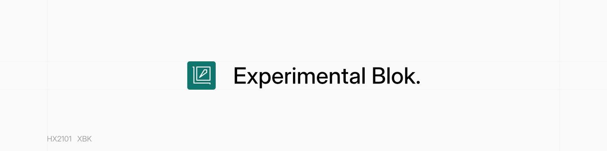
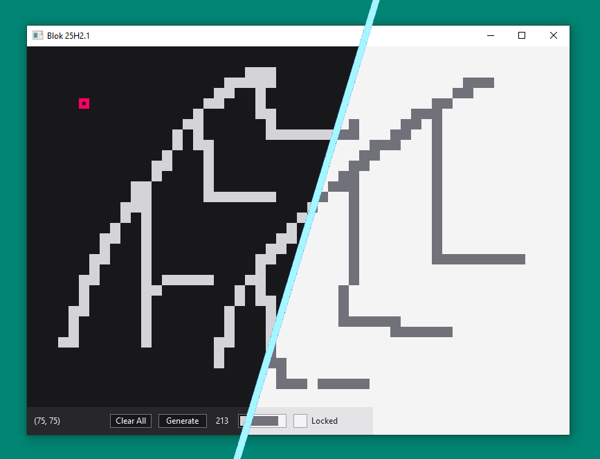
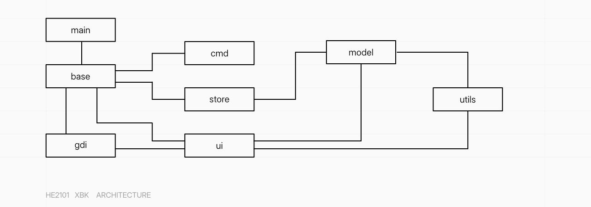

# Experimental Blok



> [!NOTE]
> This version "5.0 --25H2A" is currently still in development, the features described may
> not work correctly, at all, or subject to change. These changes will merged to main (or
> "stable enough") in Autumn 2025.

## Overview

"Experimental Blok" is a small and minimal simulation of a maze generated by the user and
a box that move around with the WASD or Arrow keys.



### The Canvas Grid

The "Canvas Grid" is the component that provides a coordinate grid scaled at fifteen or
a value specified at startup. This grid contains the movable box and a surface to create
walls ("obstructives") that the box cannot move past.

* The canvas is not limited to the startup size and can adapt to the window size.
* The grid can be toggle with the `G` key on the keyboard but is drawn before the box and
obstructive.
* Clicking on the canvas will create an obstructive.
* Drag clicking will create a series of obstructives.

### The Information and Action Panel

The "Panel" is the component that shows information and provides controls to manipulate
the canvas.

* The coordinates of the box is shown.
* The "Clear All" button removes all the obstructives from the grid.
* The "Generate" button randomly adds an obstructive on to the grid surface.
* The number provides the number of obstructives currently visible.
* The progress bar showing the internal dynamic memory size storing the obstructs.
* The locked toggle, shows whether the canvas is locked - meaning mouse clicks or drags
will not have any effect.

### The Console

The console is not initialised unless the `--show-console` argument is passed at
execution. The console displayes informational, warnings and error messages while the
program is running.

* The console does not accept user input.

### Keyboard Shortcuts

* `W`: Move box up by current scale.
* `A`: Move box right by current scale.
* `S`: Move box down by current scale.
* `D`: Move box left by current scale.
* `G`: Toggle grid lines visibility.
* `O`: Generate an obstructive at a random location.
* `I`: Toggle interface visibility.
* `T`: Change theme.
* `C`: Clear all obstructives.
* `L`: Toggle canvas lock.

## The Architecture



| Folder | Description |
| :----- | :---------- |
| (main.c) | entrypoint. |
| base   | contains the main singleton context structure (stores all program data) and lifecycle functions |
| cmd | handles the console host allocation and argument processing. |
| gdi | handles the windows drawing and painting tools, and theme handling. |
| model | model object structures and operations. |
| store | stores the object state. |
| ui | handles the user interface (including event handling and components). |
| utils | any unclassified function such as converting from blok to win -types and vise versa. |

## Compilation and Execution

This project uses the CMake build system. I use MSVC.

The executable can be run with extra arguments

```pwsh
# Runs with the defaults configuration
blok.exe

# Any of the following arguments can be passed to the program:
#
#     --light-theme
#         Specifies the program to startup with the light theme.
#
#     --dark-theme
#         Specifies the program to startup with the dark theme (default).
#
#     --show-console
#         Shows the information console while the program is running.
#         The console cannot be started after the program is running.
#
#     --scale [integer]
#         Specifies the scale in both x and y direction (default: 15).
#
#     --scale-x [integer]
#         Specifies the scale in the x direction (default: 15).
#
#     --scale-y [integer]
#         Specifies the scale in the y direction (default: 15).
```

## Changelog

* Version 5.0 --25H2A "September 2025"
  * Functionality
    * Added new keyboard shortcuts.
    * Implemented drag click.
    * Disabled console by default.
  * Internal
    * Changed entrypoint to `wWinMain`.
    * Improved performance.
    * Changed build system to CMake.
    * Updated Architecture to a contextual system.
    * Improved win32 message handling.
    * Improved window painting operation.
    * Implemented new control and component update functions.
    * Renamed `Vector` to `DynList`.
    * Refactored `Size` and `Position` to `VectorII`
    * Implemented direction to vectorii function.
    * Added new `VectorIV` type.
    * Update text rendering to use `DrawTextW` instead of `TextOutW`.
  * Visual
    * Implemented single instance mutex (mutant winobj).
    * Updated colour scheme.
    * Redesigned UI.
    * Implemented on hover styles.
    * Changed panel width.
    * Updated font to "Segoe UI".
    * Added executable resource file.
    * Reduced gdi32 flickering.
    * Implemented panel visibility.
    * Implemented grid visibility.

## Limitations and Known Issues

* Generating an Obstructive (Button/Keyboard) may create a duplicate positioned wall.
* Cannot remove a single obstructive.
* Box can go under the panel.
* Box can go out of bounds of the window.
* Specified scaling can be too small, too big or negative.
* Invalidating area can fail at certain scales, resulting in the box leaving a trail.
* Drag click can continue if the cursor leaves the window.
* Cannot control blok with arrow keys.
