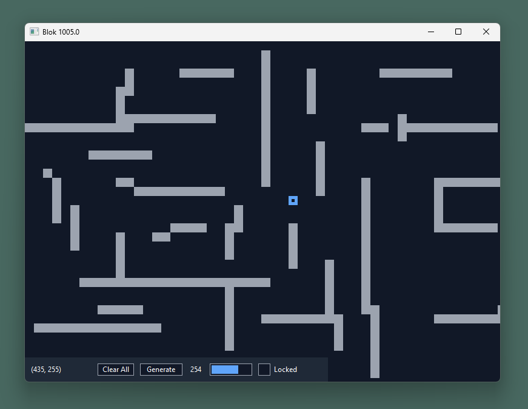
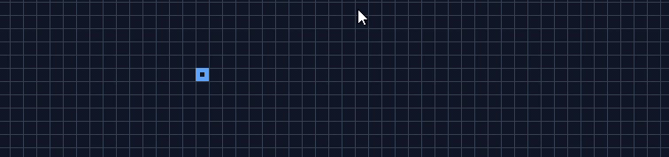
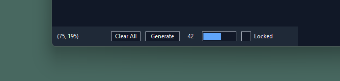

# Experimental Blok

> [!NOTE]
> As of v. 1005, this project no longer follows a fixed release rhythm - defined as
> regular merges from the next branch into main.  New features will be introduced
> progressively, with early access gated behind feature macro toggles (off by default).
>
> The next few versions will focus on stability, reliability, internal changes and
> documentation.

## Overview

<p align="center">
  
</p>

**Experimental Blok**, or simply *blok*, is a lightweight simulation of a user-generated
maze. A box entity moves around the canvas using the `WASD` or Arrow Keys, with
interactive controls for wall placement, scaling, and theming.

Originally created in February 2021 as a personal experiment to learn C and the Windows
API (after an initial C++ prototype), *Blok* had no defined goals or roadmap. The project
name emerged from a simple typo - misspelling "Block" during its early phase as
"The C Project." The first implementation rendered a box that moved freely across a native
window, but left visual trails due to missing repaint logic.

There was no formal documentation or GitHub presence during those early versions. The
motivation was exploratory - rooted in a interest with Windows internals and low-level
behaviour.

> _Curious how Blok evolved?_ See
> [the Wiki](https://github.com/harshjayprakash/experimental-blok/wiki) for development 
> history and system design. 

### The Canvas Grid

<p align="center">
  
</p>

The "Canvas Grid" is a component that provides a coordinate grid, scaled at fifteen
pixels, or another specified value at startup via the CLI. This grid contains the box
entity and a surface to create walls ("obstructs") that block the box's movement.

* The canvas adapts to the full window client area.
* The grid lines can be toggled with the `G` key, but are drawn before the box and obstructs,
  resulting in parts of the lines becoming hidden.
* A left click will create an obstruct at the current position.
* A left drag click will create a series of obstructs.
* A right click will remove an obstruct at the current position.
* A right drag click will remove a series of obstructs.

### The Information and Action Panel

<p align="center">
  
</p>

The "Panel" is the component that shows information and provides controls to manipulate
the canvas.

* The current coordinates of the box are shown.
* The "Clear All" button removes all obstructs.
* The "Generate" button adds an obstruct at a random position.
* Shows the current number of obstructs on the canvas.
* The progress bar shows the internal dynamic array memory size storing the obstructs.
* The locked toggle shows whether the canvas has been locked
  * Enabled - any clicks or drags on the canvas are ignored.
  * Disabled - normal operation.

### Keyboard Shortcuts

* `W`: Move box up by current scale.
* `A`: Move box left by current scale.
* `S`: Move box down by current scale.
* `D`: Move box right by current scale.
* `G`: Toggle grid lines visibility.
* `O`: Generate an obstructive at a random location.
* `I`: Toggle interface visibility.
* `T`: Change theme.
* `C`: Clear all obstructs.
* `L`: Toggle canvas lock.
* `M`: Generate a set of random obstructs. _experimental: to generate whole maze_.

## The Architecture

The architecture reflects a quiet intent - each module is a shaped layer in a larger
system, design not just to function, but to clarify. At its centre is the `Context`
structure, accessed via helpers.

The layout is discoverable by design:

* **main.c**: Entry point and context bootstrap.
* **core**: Defines the `Context` structure and lifecycle functions.
* **fmt**: Converts between internal *blok* types and Win32 facing values.
* **gdi**: Manages graphics tool lifetimes and theme colours.
* **model**: Shapes and organises internal data structures.
* **state**: Tracks object state.
* **ui**: Hosts components, controls, and event handling logic.

## Compilation and Execution

### Pre-requisites

> This project is tested with MSVC on Windows, using CMake as its build system. While
> MinGW may work (even on Linux under Wine), it is not officially supported, and no 
> specific steps are provided.

### Building the Project

```sh
# 1. Cloning the Repository and Move into Directory.
git clone https://github.com/harshjayprakash/experimental-blok.git
cd experimental-blok

# 2. Generate build files with CMake.
cmake -S . -B build

# 3. Compile the project
cmake --build build --config Release

# 4. Run the project
./build/Release/blok.exe
```

### Command Line Arguments

After compilation, the program can executed with various arguments to customise behaviour.
The available arguments are shown below.

| Argument          | Description                             |
| :---------------- | :-------------------------------------- |
| `--light-theme`   | Starts with the light theme.            |
| `--dark-theme`    | Starts with the dark theme. (default).  |
| `--scale [int]`   | Sets scale for both X and Y directions. |
| `--scale-x [int]` | Sets the scale for the X direction.     |
| `--scale-y [int]` | Sets the scale for the Y direction.     |

## Changelog

### Version 1005.0 - September 2025

**Overview**: This version is a complete rewrite.

#### **Functionality**

* **New Shortcuts**: Added new keyboard shortcuts for extra functionality.
* **Drag Click**: Implemented canvas drag-click for rapid obstruct creation and removal.
* **Obstruct Handling**: Re-added obstruct removal.
* **Instance Check**: Implemented a Mutex for a single running instance.
* **Custom Scaling Arguments**:
  * Implemented optional separate x and y scaling arguments.
  * Added absolute value check to handle negative inputs.
* **Non-Case Sensitive CLI Arguments**: Updated to use the `_wcsnicmp` function.

#### **Visual**

* **Panel Visibility**: Added `I` keyboard shortcut to toggle panel visibility.
* **Grid Lines**: Added `G` keyboard shortcut to toggle the grid lines visibility.
* **Font Upgrade**: Updated font to Segoe UI.
* **Redesigned UI**: Updated the UI for a more modern look.
* **Colour Scheme**: Increased colours in palette.
* **Updated Text Rendering**: Updated to use `DrawTextW` instead of `TextOutW` for richer options.
* **Hover Effects**: Add hover indication over controls.
* **Faster UI Updates**: Updated message loop to use `PeekMessage` instead of `GetMessage`.
* **Updated Panel Width**: Updated the panel to not span the whole width of the window.

#### **Internal**

* **Updated Architecture**: Focused on a more modular architecture based on the `Context`
structure.
* **Build System Update**: Switch to CMake and Microsoft Cl Compiler.
* **Fully Unicode**: Switched to the `wWinMain` entry point.
* **Enhanced Documentation**: Updated technical documentation for clarity.
* **Static Data**: Removed all file-scope static variables.
* **Simplified Return Values**: Functions return an integer instead of a result. (If not
applicable, data is returned.)
* **Refactor Types**: Renamed `Vector` to `DynList`, and `position` and `size` to
`VectorII`.
* **Extracted Modules**: Modularised additional modules
  * **State Module**: An abstraction from direct data modification for the UI and stores
the object data.
  * **Graphics**: A store for GDI graphics tools and colours decoupled from the UI.
  * **Arguments**: Updated to not rely on global application-specific functions.
* **Top-Level UI Module**: Added an encapsulated Viewport UI module.
* **Update Naming Conventions**:
  * Variables prefixed with `p` if pointer, `h` if handle.
  * Function names follow `st` + `<file-scope>` + `<function-name>()`.
  * Function names are prefix with `_` if static.
  * Structures and enumerations are Pascal Case with `_` prefix.
  * Typedef follow Pascal Case and prefixed with `T`.
* **List Node Removal**: Add Node Removal on DynList API.
* **Add Conversion Util Functions**:
  * Implemented WinTypes to BlokTypes and vice versa.
  * Implemented Direction to Vector function.
* **Extracted UI Logic**
  * **Process Event Methods**: Re-implemented event functions.
  * **Action UI Methods**: Re-implemented a set of abstracted functions for the UI to
call state functions and updates.
* **Modular Controls and Components**:
  * Add separate update functions.
  * Updated to not rely on the caller updating control/component attributes.
* **Simplify Model Grouping**: Flatten folder model structure.
* **Remove Unused**: Removed any unused functions or structures.
* **Updated Codename**: `st` for `Sandstone`.

## Limitations and Known Issues

* **Layout/Positioning**: The box may be positioned outside of the bounds.
* **Panel Overlay**: The box can be covered by the panel. *This behaviour may persist by*
*design in future revisions.*
* **Scaling Sensitivity**: Specified scaling value may produce an unusable small or
oversize grid.
* **Drag Persistence**: Drag-click interaction can persist even if the cursor leaves
the window boundary.
* **Hitbox Detection**: Buttons and toggle regions have imprecise hit detection.

## Potential Future Features (No Specific Date).

* **Path Finding**: Finding the shortest path between two points.
* **Movable Panel**: Allow the user to move the panel by introducing a draggable area.
* **Notify System**: Providing feedback for operations that failed.
* **Custom Theming**: Allow user to theme the application to their liking.
* **Help Guide**: Provide in-application guidance on how to use it.
* **Save State**: Save and Import state from a file.
* **Configuration File**: Provide a method to import settings from a file on startup.
* **Generate Maze**: Allow entire maze generation.
