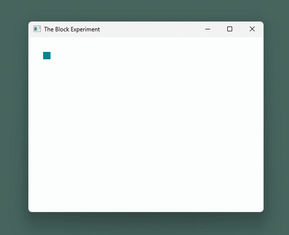

# Development History

While *Blok* has evolved into a modular, intentionally designed project, early versions
were built organically - with limited or no technical documentation. This history
attempts to reconstruct and narrate major shifts from memory and surviving prototypes.

## Phase I - The Origins

  
   
  <caption>
    <i>A recreation of Blok as of September 2021.</i>
  </caption>

